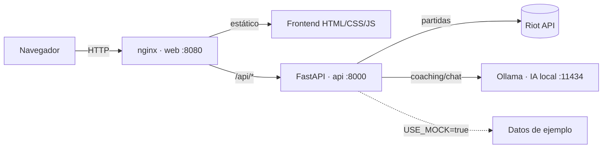

# Arquitectura de DivisionUp

## Componentes


- **web (nginx):** sirve el frontend estático y hace de proxy: `/api/*` → `api:8000`.
- **api (FastAPI):** lógica de negocio. En modo mock devuelve datos de ejemplo; en modo real llama a Riot y Ollama.
- **ollama:** modelo de lenguaje local que genera el coaching y responde el chat.
- **ollama-pull:** servicio efímero que descarga el modelo la primera vez.

## Flujo del coaching (modo real)
```
1. Frontend → GET /api/coaching/report/{game}/{match_id}?riot_id=Nombre#TAG
2. api → riot_client.get_puuid()  +  riot_client.get_match(match_id)
3. prompts.extract_summary(game, match, puuid)  → resumen estructurado
4. ollama_client.generate(prompt, system=COACH_SYSTEM, json_mode=True)
5. prompts.parse_report(json) → CoachingReport (validado con Pydantic)
6. Frontend renderiza el informe + habilita el chat (POST /api/chat)
```
En **modo mock** los pasos 2-5 se sustituyen por `data/mock.py`.

## Contrato de datos
Definido en `backend/app/schemas/models.py` (Pydantic). Modelos principales:
- `MatchCard` — tarjeta de partida (lista de coaching).
- `CoachingReport` — informe (verdict, focus, metrics, did_well, errors, corrective, action_plan).
- `ChatRequest` / `ChatResponse` — chat del coach.
- `MetaComp` — entrada de la tier list.

El frontend solo conoce estos modelos: cambiar de mock a real **no** altera la forma de las respuestas.

## Endpoints
| Método | Ruta | Descripción |
|--------|------|-------------|
| GET | `/health`, `/healthz` | Salud |
| GET | `/riot/account?riot_id=` | Riot ID → puuid |
| GET | `/coaching/matches?game=&riot_id=` | Partidas recientes |
| GET | `/coaching/report/{game}/{match_id}?riot_id=` | Informe de coaching |
| POST | `/chat` | Pregunta al coach (cuerpo: game, match_id, question, riot_id) |
| GET | `/stats?game=&riot_id=` | Estadísticas personales agregadas |
| GET | `/meta?game=` | Tier list (dataset curado) |

## Decisiones de diseño
- **API-first con mocks:** la API expone los endpoints reales devolviendo ejemplos; el frontend se integra antes de cablear Riot/IA. `USE_MOCK` controla el modo.
- **Caché:** el detalle de partida es inmutable → se cachea 24 h (`services/cache.py`).
- **Routing Riot:** account-v1 y match usan host regional (`europe`/`americas`/`asia`).
- **Meta global = dataset curado:** no se deriva del historial de un jugador; requeriría un pipeline de datos de alto elo (trabajo futuro).

## Etapas
- **Etapa 1:** prototipo HTML autónomo (`synapse-prototipo/`, tag `prototipo-etapa-1`).
- **Etapa 2:** este backend + frontend conectado + despliegue (fases 0-5).
